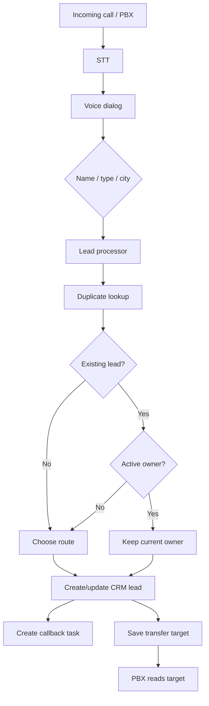

# Call Flow Bitrix

Implementation of an event-driven inbound call routing system built with n8n, telephony webhooks, speech-to-text/text-to-speech, an LLM classifier, and Bitrix24 REST API.

> This repository contains a sanitized demonstration implementation based on real-world engineering problems. It contains no proprietary source code history, production credentials, customer data, production domains, employee identities, or internal company identifiers.

## What it demonstrates

- inbound voice dialog orchestration;
- STT/TTS integration with Yandex Cloud;
- extraction of caller name, client type and city;
- B2B/B2C routing;
- preservation of an existing active CRM owner;
- reassignment when the existing owner is inactive/unknown;
- duplicate lead lookup;
- lead creation/update;
- callback task creation;
- CRM timeline comments and chat notifications;
- transfer target persistence via n8n Data Tables.

## Architecture



## Quick start

1. Clone the repository.
2. Copy environment template:

```bash
cp .env.example .env
```

3. Fill in your own credentials and public URLs.
4. Start n8n:

```bash
docker compose up -d
```

5. Open n8n and import JSON files from `workflows/`.
6. Create the required n8n Data Tables using `docs/data-tables.md`.
7. In imported Data Table nodes, select the tables you created.
8. Configure your PBX/telephony provider to call the documented webhooks.

## Important configuration

The exported workflows intentionally contain placeholders such as:

```text
REPLACE_WITH_VOICE_DIALOG_STATE_TABLE_ID
REPLACE_WITH_TRANSFER_TARGETS_TABLE_ID
REPLACE_WITH_LEAD_DUTY_QUEUE_TABLE_ID
```

After importing the workflows, open each Data Table node and select the appropriate table in your own n8n instance.

CRM and cloud secrets are read from environment variables rather than stored in workflow JSON.

## Repository layout

```text
crm-call-router/
├── workflows/          Sanitized n8n workflow exports
├── config/             Example routing configuration
├── examples/           Synthetic webhook payloads
├── docs/               Architecture and deployment notes
├── scripts/            Local security scan
├── .env.example
├── .gitignore
├── docker-compose.yml
├── SECURITY.md
└── README.md
```

## Demo routing policy

The public version intentionally uses synthetic managers (`Manager A`, `Manager B`, etc.) and a deterministic demo duty rotation. Replace it with your own schedule, database lookup or workforce-management API.

The routing behavior retained from the implementation is:

- a new B2B lead is assigned according to the routing policy;
- B2C leads are assigned to a configured B2C manager;
- an existing lead owned by an active manager keeps that manager;
- an existing lead with an inactive/unknown owner is reassigned;
- transfer extensions are stored for the PBX to retrieve.

## Security

Never commit `.env` or production workflow exports. Run:

```bash
python3 scripts/secret_scan.py
```

before every public push.

See `SECURITY.md`.
