# Call Flow Bitrix

A system for automatic processing and routing of incoming calls with telephony integration, n8n and Bitrix24.

The solution automatically processes the incoming call: it recognizes the client’s speech, determines their name, segment, and city, checks existing cases in the CRM, selects the responsible manager, and returns the telephony route for call transfer.

## Problem
Handling an incoming call requires more than simply answering it. The system also needs to determine who should receive the call.

Without automation, an employee has to manually:

identify the caller;
- determine whether the client is B2B or B2C;
- search for the client in the CRM;
- check whether an account manager is already assigned;
- select a manager for a new client;
- transfer the call;
- create or update the CRM record;
- handle interrupted or incomplete calls.

## Task
### When there is a large number of incoming calls, manual routing creates several problems:

- the operator needs to determine who is calling;
- to understand whether the client is an individual or a legal entity;
- check whether the client exists in the CRM;
- determine the current responsible person;
- transfer the call.

The goal of the project was to automate this process and connect telephony and CRM into a single routing system.

## Key Features

- Speech-to-Text processing for incoming calls;
- AI-based extraction of caller name, client type, and city;
- existing client lookup in Bitrix24;
- preservation of the current account manager for repeat calls;
- automatic routing of new B2B and B2C clients;
- primary, secondary, and fallback routing;
- lead creation and update.

## Result
The system makes routing decisions automatically based on caller data and CRM state. Repeat callers remain assigned to their existing manager, while new clients are routed according to a configurable distribution policy.

## Architecture

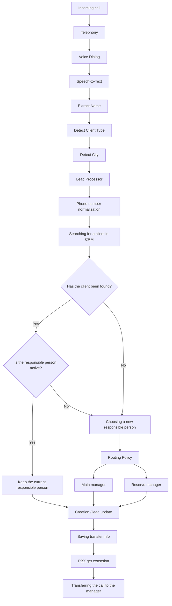

## Workflow demonstration

The solution is split into several independent n8n workflows. Each workflow has a narrow responsibility, while together they form a complete call-processing pipeline.

### The main workflow for lead processing

The central workflow responsible for CRM processing and routing decisions.

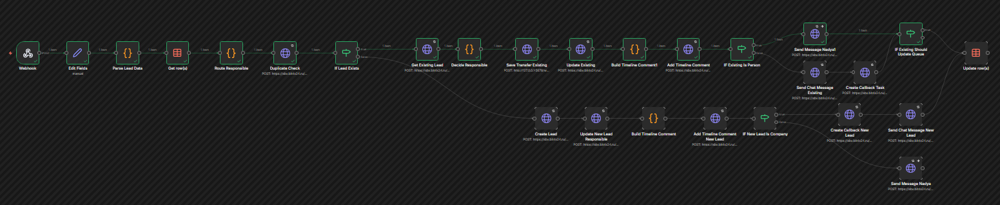

The lead_processor performs the main business logic:

- normalizes the phone number;
- searches for existing CRM records;
- detects duplicates;
- checks the current responsible manager;
- determines whether the current assignment should be preserved;
- selects a manager for a new client;
- creates or updates the Bitrix24 lead;
- creates CRM tasks when required;
- stores routing information for the telephony system.

For B2B clients, the routing logic can take a duty schedule into account and select primary and secondary managers according to the current routing turn. For repeat calls, the workflow can preserve the existing responsible manager instead of assigning the client again.

### voice_dialog_name

Handles the caller name collection stage. The workflow receives the caller's recognized text, extracts a structured client name using LLM processing, and stores the result in the shared dialog state.

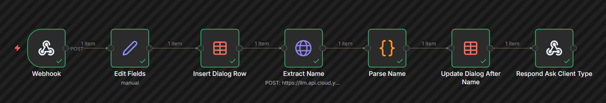

### voice_dialog_type

Determines the caller segment.
The workflow analyzes the caller's response and classifies the client as: B2B, B2C, Unknown/

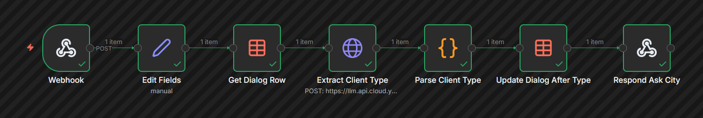

### voice_dialog_city

Collects and normalizes the caller's city. After the city is extracted, the workflow updates the dialog state and performs additional service-area validation.

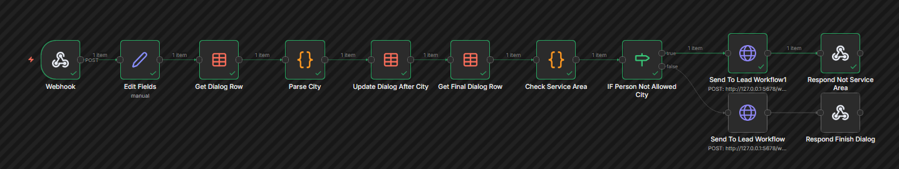

### voice_dialog_reset

Clears the stored dialog state for a phone number.

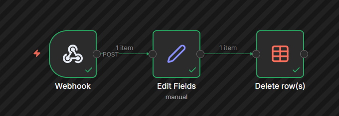

### stt_test_name

Acts as the speech-processing gateway for the name stage. It accepts incoming audio, sends the audio to Speech-to-Text, parses the recognition result, and forwards the recognized text to voice_dialog_name.

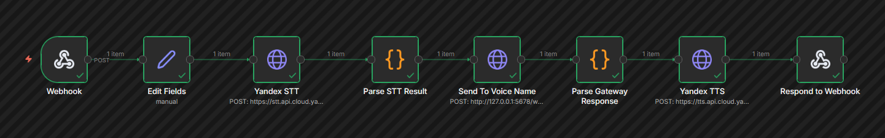

### stt_test_type

Performs the same gateway role for the client-type stage.

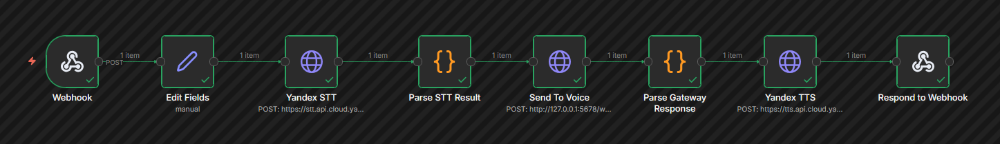

### stt_test_city

Handles audio processing for the city.

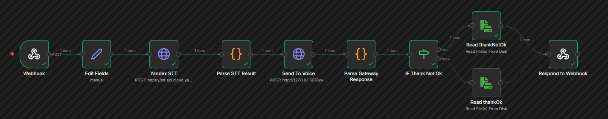

### save_transfer_info

Stores the final routing decision calculated by lead_processor. The information is persisted in an n8n Data Table so the telephony system does not need to execute the entire CRM workflow again when it is ready to perform the transfer.

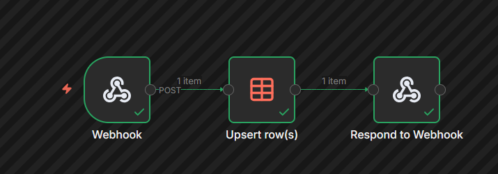

### get_transfer_info

Provides the routing result back to the telephony system. The workflow receives a phone number from the PBX, normalizes it, reads the previously calculated route from the Data Table, and returns the transfer information.

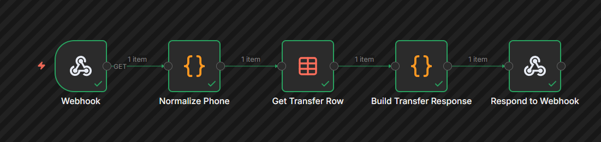

## Overall Flow

Together, the workflows form one processing chain. 
The architecture deliberately separates three different responsibilities:

Speech layer. Handles audio, Speech-to-Text, Text-to-Speech, and communication with the telephony platform.

Dialog layer. Collects and structures caller information while maintaining conversation state between individual dialog stages.

Business layer. Works with Bitrix24, checks existing clients, applies routing rules, assigns responsible managers, updates CRM records, and calculates the final call destination.

This separation keeps telephony-specific processing independent from CRM business logic. As a result, individual parts of the system can be tested, modified, or replaced without rebuilding the entire call-routing process.

## Installation

1. Clone the repository.

```bash
git clone git@github.com:ValeriaGjff/Call-Flow-Bitrix.git
cd Call-Flow-Bitrix
```

2. Create .env

```bash
cp .env.example .env
```

3. Fill in your own credentials and public URLs.

4. Start n8n:

```bash
docker compose up -d
```

5. Open n8n and import JSON files from `workflows/`.

6. Create the required n8n Data Tables using `docs/data-tables.md`.

7. In imported Data Table nodes, select the tables you created.

8. Configure your PBX/telephony provider to call the documented webhooks.
